# User Guide

<hr class="solid">

## Deploying Locally

Clone the project

```bash
  git clone https://github.com/xSolstice1/ICT302_Project.git
```

Go to the project directory

```bash
  cd my-project
```

Install dependencies

```bash
  https://dotnet.microsoft.com/en-us/download [.NET 6.0]
```

Start the server

```bash
  dotnet watch run
```
<hr class="solid">

## **Login Screen**

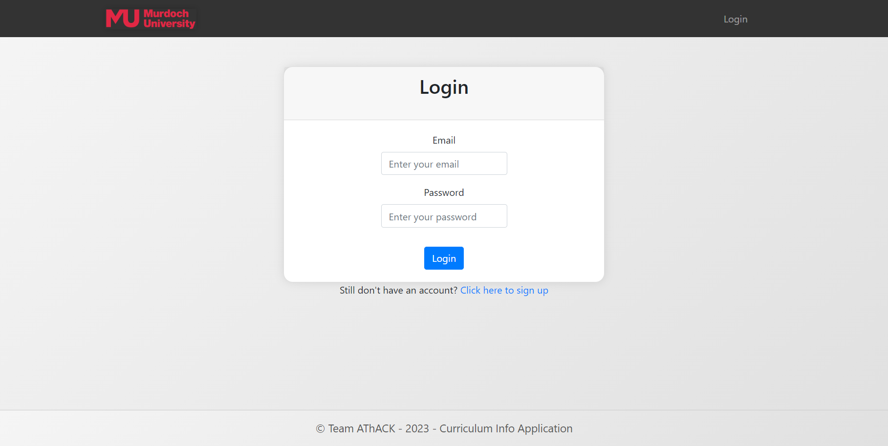

#####The Login Screen is the gateway to accessing the application's features. 
#####Follow the steps below to log in:
<br/>
### 1. Enter Credentials:
#####Provide your registered email address and password in the designated fields.
*<label class="form-label">Email</label>*
<input class = "form-control", type="email", placeholder = "Enter your email", required = "required">
*<label for="login-password" class="form-label">Password</label>*
<input class = "form-control", type="password", placeholder = "Enter your password", required = "required">

### 2. Submit the Form: 
#####Click the "Login" button to submit the login form:
<button type="submit" class="btn btn-primary btn-new">Login</button>

### 3. Error Handling:
#####If there's an issue with the provided credentials, an error message will be displayed:
<div class="alert alert-danger">
Invalid username or password.
</div>

### 4. Account Creation:
#####If you don't have an account yet, you can sign up by clicking the link below the login form:
*<p>Still don't have an account? <a href="javascript:void(0);" id="toggle-signup">Click here to sign up</a></p>*

<hr class="solid">

## **Sign Up Screen**

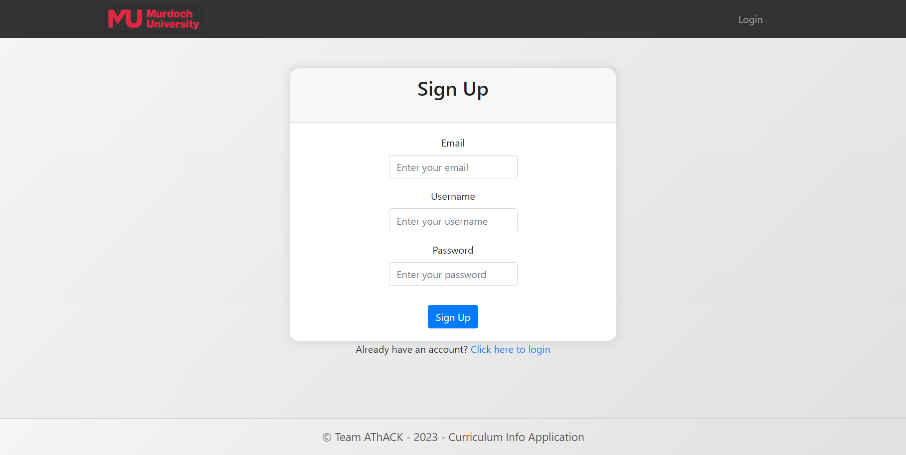

##### If you have not register your account before, 
##### Follow the steps below to sign up:
<br/>

### 1. Navigate to the Sign Up Screen:
##### Visit the application and click on the "Sign Up" link on the Login Screen.
*<p>Still don't have an account? <a href="javascript:void(0);" id="toggle-signup">Click here to sign up</a></p>*

### 2. Fill in Registration Details

*<label class="form-label">Email</label>*
<input class = "form-control", type="email", placeholder = "Enter your email", required = "required">
*<label class="form-label">Username</label>*
<input class = "form-control", type="text", placeholder = "Enter your username", required = "required">
*<label for="login-password" class="form-label">Password</label>*
<input class = "form-control", type="password", placeholder = "Enter your password", required = "required">

### 3. Submit the Form: 
#####Click the "Sign Up" button to submit the sign up form:
<button type="submit" class="btn btn-primary btn-new">Sign Up</button>

### 4. Confirmation Messages:
##### If the account creation is successful, you will see a success message:
<div class="alert alert-success">
Account created.
</div>

### 5. Error Handling:
##### If there's an issue with the provided credentials, an error message will be displayed:
<div class="alert alert-danger">
Registration failed. Please try again.
</div>

### 6. Returning Users
##### If you already have an account, you can easily switch back to the Login Screen:
*<p>Already have an account? <a href="javascript:void(0);" id="toggle-login">Click here to login</a></p>*

<hr class="solid">

## **Import Screen**

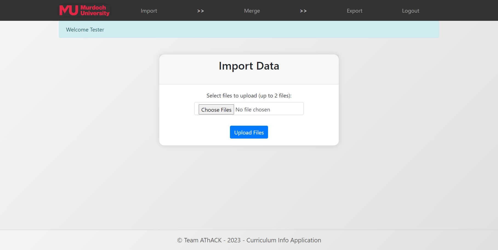

##### The Import Data feature allows you to upload and process CSV, XLS, or XLSX files to populate your application with data.

<br/>

### 1. Access the Import Page
##### Navigate to the Import Data page by clicking on the "Import" option in the application.


### 2. Upload Files
##### I. Click on the "Choose Files" button.
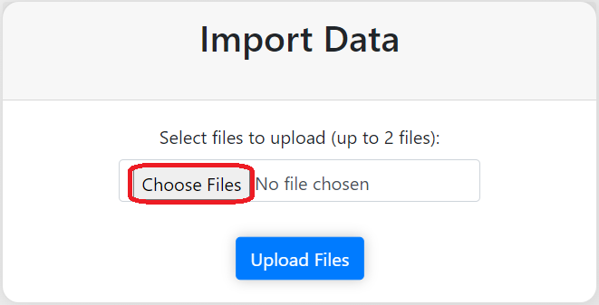
##### II. Choose the CSV, XLS, or XLSX files you want to import. You can select up to 2 files.
##### III. You may also drag and drop your files into the column.
##### IV. Click "Upload Files" to start the import process.
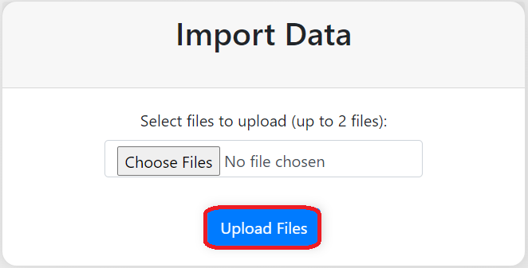

### 3. Wait for Processing
##### The application will process the uploaded files. This may take some time depending on the file size and complexity.

<br/>

### 4. Review Results
##### I. Once the import is complete, review the results.
##### II. If successful, you will see a success message.
##### III. If there are errors, an error message will be displayed. Correct the issues and try importing again.

<br/>

### 5. Proceed to Merge (Optional)
##### I. If you have uploaded two files, you will be prompted to proceed to the "Merge" page.
##### II. Here, you can join the imported data based on selected columns.
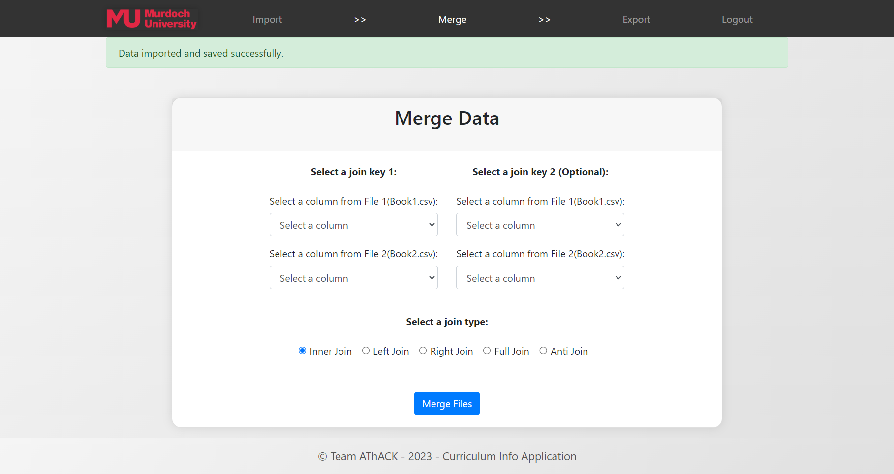

*Supported File Formats*<br/>
- CSV (Comma-Separated Values<br/>
- XLS (Excel 97-2003)<br/>
- XLSX (Excel 2007 or later)<br/>

*Important Notes*<br/>
- Ensure that your files adhere to the supported file formats.<br/>
- Application only allowed import max 2 files.<br/>
- The application may enforce specific rules or constraints during import. Review error messages for guidance.<br/>

*For additional assistance, contact support or refer to the application documentation.*

<hr class="solid">

## **Merge Screen**


##### The Merge Data feature allows you to join two XML files based on specified columns and perform various types of joins. This user guide provides step-by-step instructions on using the Merge Data functionality.
<br/>

#### Prerequisites
*Before you begin, make sure you have the following:*<br/>
- *Two XML files to be merged (`File 1` and `File 2`).*<br/>
- *Understanding of the columns you want to join on (`Join Key 1` and optionally `Join Key 2`).*<br/>

<br/>

### 1. Selecting Join Keys
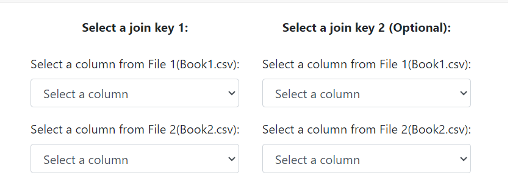
#### Join Key 1:
##### Choose a column from `File 1` and `File 2` to serve as the primary join key.
<br/>

#### Join Key 2 (Optional):
##### If needed, select additional columns from both files for a more complex join. But, the join type will be only allowed concatenated join.
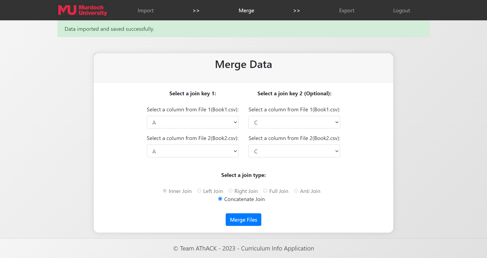

### 3: Choosing Join Type
##### Select the type of join you want to perform:
###### *Inner Join*
###### *Left Join*
###### *Right Join*
###### *Full Join*
###### *Anti Join*
###### *Concatenate Join* (For join key 2 selected)

<br/>

### 4: Merging Data
##### - Click the "Merge Files" button to initiate the merge process.
##### - The application will redirect to export page to display the merged data.

<br/>

*Additional Notes*<br/>
- Invalid characters in column names are automatically replaced with underscores (`_`).<br/>
- Duplicate element names are resolved by adding numerical suffixes.<br/>
- The application provides options for various types of joins and concatenation.<br/>

*Troubleshooting*<br/>
If you encounter any issues during the merge process, an error message will be displayed. 
Please review the error message and ensure that you have followed the instructions correctly.<br/>
For further assistance, contact the system administrator.<br/>

<hr class="solid">

## Export Screen

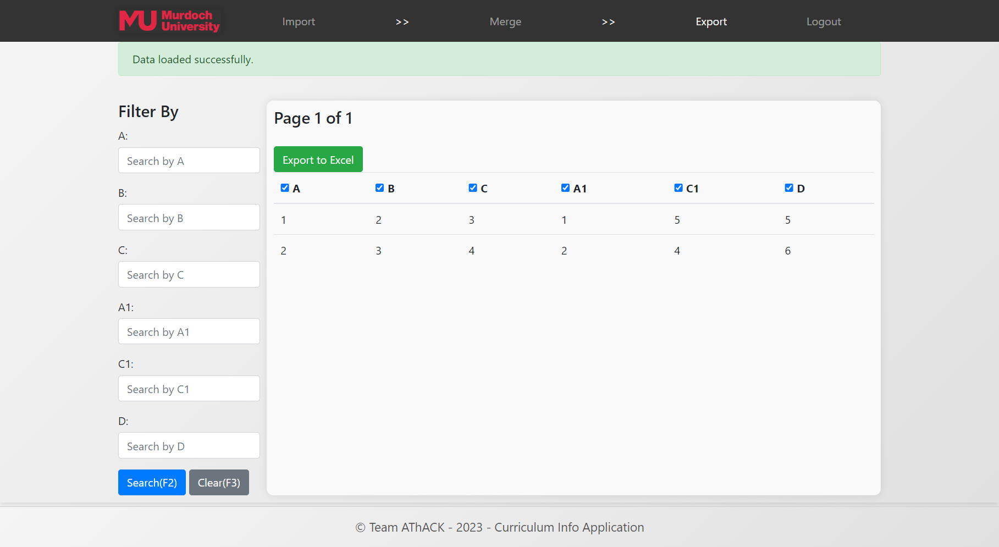

##### The Export Data feature allows you to view and export merged XML data to Excel. <br/><br/>
#### Export Page Overview
*The Export page provides the following features:*<br/>
**Filter By:** *Narrow down the displayed data by entering search criteria for specific columns.*<br/>
**Pagination:** *Navigate through the data with pagination controls.*<br/>
**Export to Excel:** *Create an Excel file containing the displayed data.*<br/>

#### Prerequisites
*Before you begin, ensure you have already performed the data merge using the Merge Data feature.*<br/>

<br/>

### 1. Filter Data (Optional)
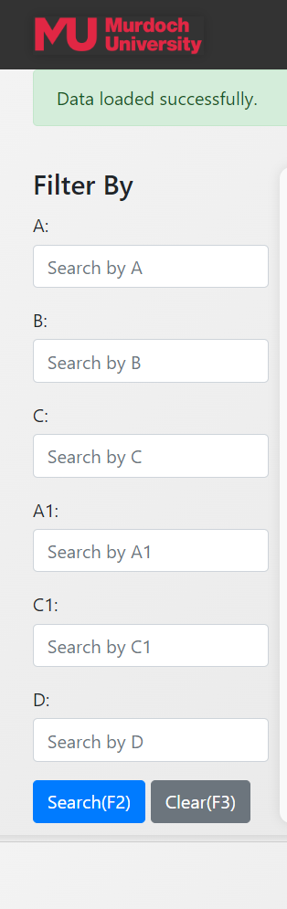
##### - Use the "Filter By" section to refine the displayed data.
##### - Enter search criteria for specific columns.
##### - Click the "Search (F2)" button to apply the filters.
##### - Click the "Clear (F3)" button to reset filters.
<br/>

#### 2. Pagination
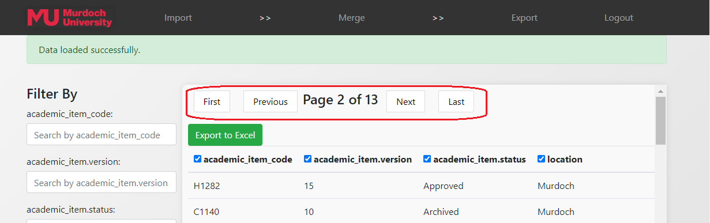
##### - Navigate through the pages using the pagination controls.
##### - The current page and total pages are displayed.
<br/>

### 3: Selecting Columns
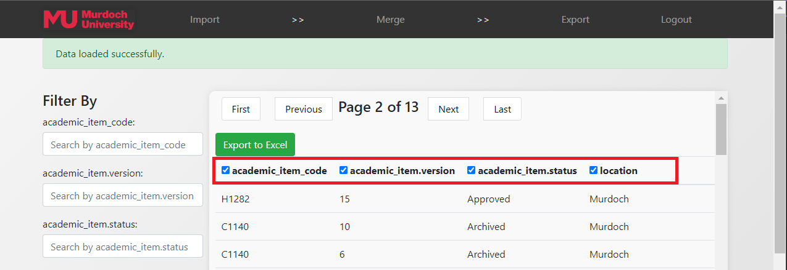
##### - By default, all columns are selected for export.
##### - Uncheck columns using the checkboxes if you want to exclude them from the export.
<br/>

### 4: Export to Excel
<button id="exportButton" class="btn btn-success">Export to Excel</button>
##### - Click the "Export to Excel" button to generate an Excel file.
##### - The file will contain the displayed data based on the applied filters and selected columns.
<br/>

*Additional Notes*<br/>
**File Naming:** The exported file is named "exportedData.xlsx".<br/>
**Column Selection:** Choose specific columns for export by unchecking the corresponding checkboxes.
<br/>

*Troubleshooting*<br/>
If you encounter any issues during the merge process, an error message will be displayed. 
Please review the error message and ensure that you have followed the instructions correctly.<br/>
For further assistance, contact the system administrator.<br/>

<hr class="solid">

# Admin Guide

## User Screen

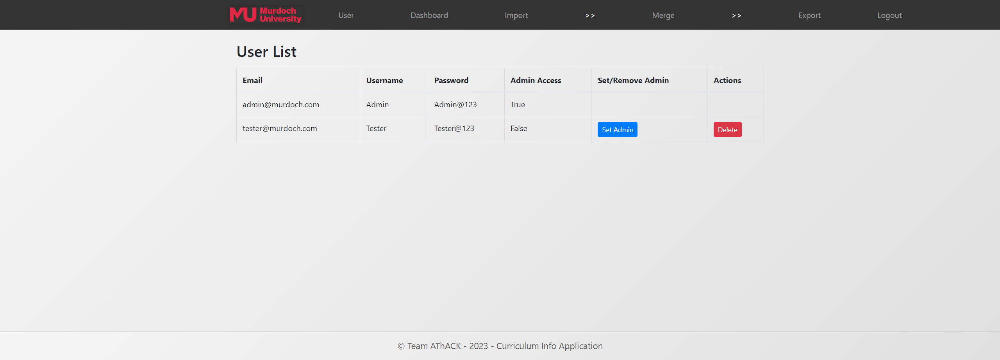

##### The Admin Management feature allows you to view and manage user accounts, including setting or removing admin privileges and deleting user accounts.
<br/>

##### The User List page displays a table with user information, including email, username, password, admin access status, and actions you can perform on each user.
**Email:** User's email address.<br/>
**Username:** User's username.<br/>
**Password:** User's password (for display purposes only).<br/>
**Admin Access:** Indicates whether the user has admin privileges.<br/>
**Set/Remove Admin:** Button to toggle admin status for each user.<br/>
**Actions:** Buttons to perform actions such as deleting a user.<br/>

#### Prerequisites
*Before you begin using the Admin Management functionality, ensure you have logged in to the application.*<br/>


### 1. Viewing User Information
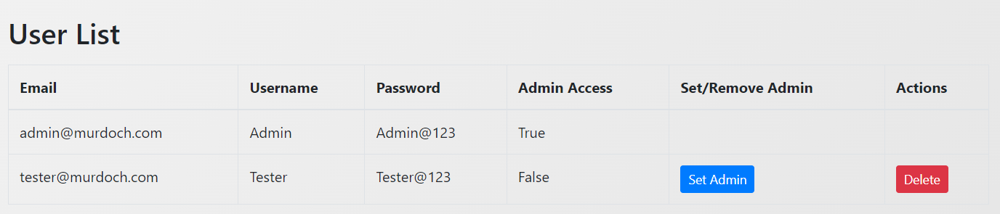
##### The table displays user information, including email, username, password, and admin access status.
<br/>

#### 2. Setting/Removing Admin Access
##### Locate the user for whom you want to change admin access.
##### If the user's email is not the currently logged-in user's email:
##### Click the "Set Admin" button to grant admin access.
<button type="submit" class="btn btn-primary btn-sm">Set Admin</button>
##### Click the "Remove Admin" button to revoke admin access.
<button type="submit" class="btn btn-primary btn-sm">Remove Admin</button>
<br/>

### 3: Deleting a User
<button type="submit" class="btn btn-danger btn-sm">Delete</button>
##### Locate the user you want to delete,click the "Delete" button.
<br/>

*Additional Notes*<br/>
**Current User Email:** The email address of the currently logged-in user is not allowed to perform actions on itself.<br/>
<br/>

<hr class="solid">

## Dashboard Screen

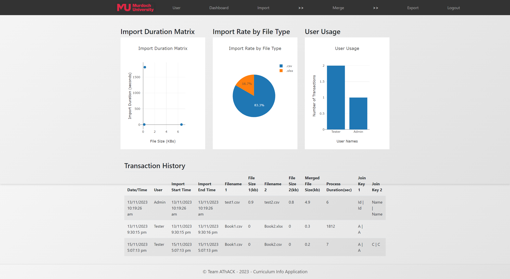

##### The Dashboard provides a comprehensive view of important statistics and transaction history. It includes visual representations such as charts for import duration, import rate by file type, and user usage. Additionally, it displays a table containing detailed transaction history.
<br/>

### Import Duration Matrix

##### *Located in the left column of the dashboard.*
##### - Represents the relationship between file size and import duration.
##### - Each point on the chart corresponds to a transaction, showing the import duration based on the total file size.

<br/>

### Import Rate by File Type
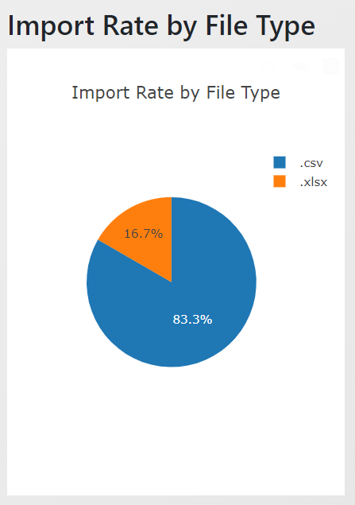
##### *Located in the left column of the dashboard.*
##### - Represents the relationship between file size and import duration.
##### - Each point on the chart corresponds to a transaction, showing the import duration based on the total file size.

<br/>

### User Usage Bar Chart
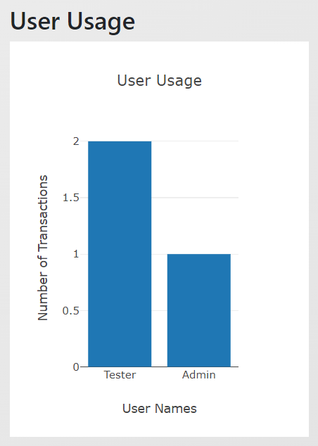
##### *Located in the right column of the dashboard.*
##### - Displays the number of transactions performed by each user.
##### - Each bar represents a user, and its height indicates the transaction count.

<br/>

### Transaction History Table
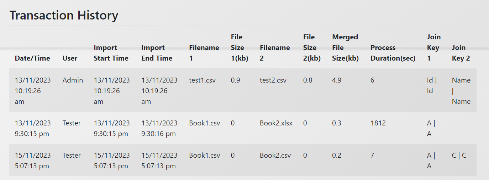
##### *Located below the charts.*
##### - Presents a detailed history of transactions.
##### - Includes information such as date/time, user, import start/end time, filenames, file sizes, merged file size, process duration, and join keys.

<br/>


*Additional Notes*<br/>
**Automated Transaction Cleanup:** Old transactions are automatically deleted to maintain data relevance, and his cleanup is performed upon accessing the Dashboard.<br/>
**Interactive Charts:** Charts are interactive and respond to user actions. Hover over points or segments to view additional information. <br/>
<br/>

<hr class="solid">

# Video Tutorial

<video controls width="600" height="400">
    <source src="../images/UserGuide.mp4" type="video/mp4">
</video>
